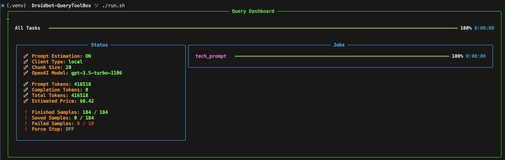

# `zachakit.query` Guide

> Last updated: 2024.03.14, Version: v0.1.1



This module is the first to be released for a convenient dashboard when sending queries using [OpenAI API](https://github.com/openai/openai-python) keys in a batch.

## ✨ Features

- **Pretty dashboard** displaying essential information based on [rich](https://github.com/Textualize/rich).
- **Multi-threading** mechanism for faster query process.
- **Token & Price estimation**.
- **Saving results in real-time**.
- **Local API-key & Microsoft Azure supported**.

## ⚙️ Usage

### Prepare prompts

Every line of the `.jsonl` is a dict with a key called `message_param`. That's it.

```json
{"message_param": [{"role": "system", "content": "You are a helpful assistant."}, {"role": "user", "content": "Hello!"}]}
{"message_param": [{"role": "user", "content": "Hello!"}]}
```

<details>
<summary>Advanced Usage</summary>

- 📣 Each prompt can has its own query settings, too:
```json
{"message_param": [{"role": "user", "content": "Hello!"}], "temperature": 0.75}
```

> All OpenAI query settings are supported. Check [this](https://platform.openai.com/docs/api-reference/chat/create) for reference. Such as `frequency_penalty`, `logit_bias`, etc.

- 📣 By default, each prompt could be retried for **10 times** at most. If the number of retries exceeds this limit, this sample will be marked as failed. You can change it like this:
```json
{"message_param": [{"role": "user", "content": "Hello!"}], "retry_limit": 15}
```

</details>

### ❗️Set OpenAI key in `.env` file

If you are going to use your own api key, this step could be very important.

> If you want to use Azure service provided by Microsoft, you can skip this section, since needed environment variables are all set on your system.

To ensure the secret key will not be uploaded to the Internet accidentally, I utilize 
[python-dotenv](https://github.com/theskumar/python-dotenv) for convenient environment variable management.

To start with, you need to edit a `.env` file in your current workspace path, with the content below:
```bash
OPENAI_API_KEY="your-api-key"
BASE_URL="your-base-url"
```

> If you do not know what `BASE_URL` means, you may not need it. It should be specified if you buy your key from a third-party platform.

### Run the program

Put all your `.jsonl` files into a folder. My module will scan it and finally arrange the result the same as it.

If you put all your `.jsonl` files into a folder named `example`, and you want to get your results in `output`, just run the code below:

```text
python -m zachakit.query -i example -o output
```

- You can append `--prompt-debug` to your command to utilize the token estimation function (without actually sending queries).
- The default model is `gpt-3.5-turbo-1106`. Use `--model-name gpt-4` to switch. Check [this](https://platform.openai.com/docs/models/overview) to 
figure out which models are supported.
- set `--chunk-size` to change auto-saving behavior. By default, the program will save 20 results per time. After finishing all your results should be re-organized. 
- If you want to recover results from tmp-checkpoints, add `--recover-only`.

<details>
<summary>Full Options</summary>

```text
python -m zachakit.query --help

usage: python -m zachakit.query [-h] -i INPUT_DIR -o OUTPUT_DIR [--model-name MODEL_NAME] [--client {local,azure}] [--chunk-size CHUNK_SIZE] [--prompt-debug] [--failure-limit FAILURE_LIMIT]
                [--recover_only]

options:
  -h, --help            show this help message and exit
  -i INPUT_DIR, --input-dir INPUT_DIR
                        Directory containing json line files used for query.
  -o OUTPUT_DIR, --output-dir OUTPUT_DIR
                        Directory to save result json line files.
  --model-name MODEL_NAME
                        OpenAI model name used for query.
  --client {local,azure}
                        Use web OpenAI API(local) or use Microsoft Azure API(azure).
  --chunk-size CHUNK_SIZE
                        Chunk size to save while querying.
  --prompt-debug        Set to estimate prompt tokens. NOTICE: completion tokens cannot be estimated.
  --failure-limit FAILURE_LIMIT
                        When such numbers of failure samples are detected, the query process will be shut down.
  --recover_only        Recover from ckpt only instead of sending new queries.
```

</details>